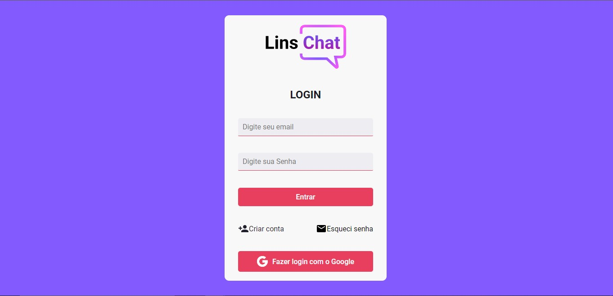
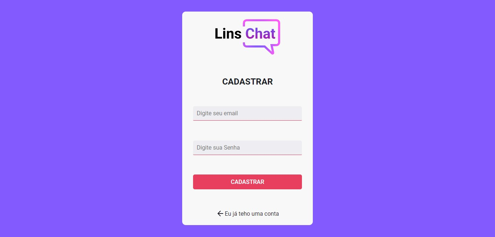
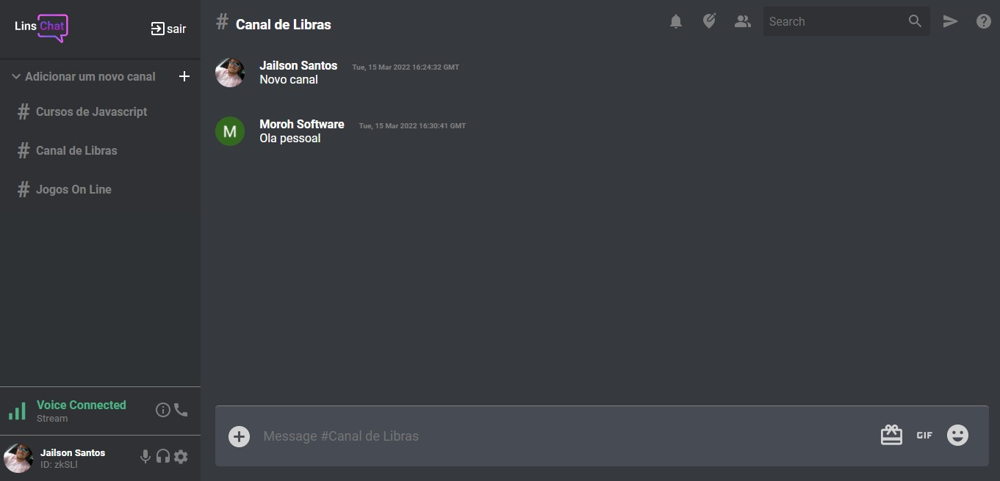
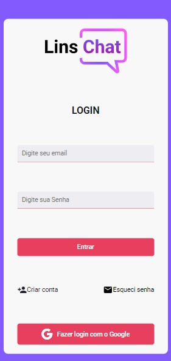
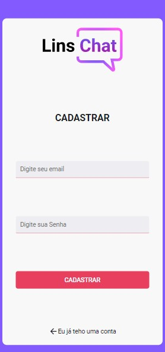

## Para usar o projeto basta dar um gitclone no repositório;

### Instalar as dependencias rode um dos domandos abaixo:
- yarn ou npm install

#### Para rodar o projeto basta entrar no diretório do projeto e rodar um dos comandos abaixo:
- yarn start ou npm start

<h1 align="center">
  
</h1>

  Uma aplicação web responsivo para criação de salas de conversas e bate papo.

<h2 align="center">Tabela de Conteúdos</h2>

  • <a href="#sobre">Sobre</a>
  • <a href="#funcionalidades">Funcionalidades</a>
  • <a href="#tecnologias">Tecnologias</a> 
  • <a href="#status">Status do Projeto</a> 
  • <a href="#autor">Autor</a>
  • <a href="#licenca">Licença</a>

<h2 align="center" id="sobre">Sobre</h2>

Uma aplicação web onde o usuário após logar com sua conta Google, ou criar uma conta com outro e-mail válido, terá a opção de criar um canal de conversas, ou mesmo de participar dos canais já exisntes, podendo assim ter uma ótima experiência em desenvolver seu Network.

<h3 align="left" id="funcionalidades">Funcionalidades</h3>

- [x] Fazer login na conta Google;
- [x] Cadastar usuário;
- [x] Recuperar senha do usuário via e-mail;
- [x] Criar um novo canal de conversa;
- [x] Conversar com outros usuários em um canal já existente;
- [x] Fazer logout;

<h3 align="left" id="layout">Versao Web responsivo</h3>

  
  
  

  
  

<h3 align="left" id="tecnologias">🛠 Tecnologias</h3>

As seguintes Tecnologias e bibliotecas que foram usadas na construção do projeto

- [Node.js](https://nodejs.org/en/)
- [ReactJS](https://pt-br.reactjs.org/)
- [Styled-components](https://styled-components.com/docs/basics)
- [Redux](https://redux.js.org/)
- [Redux Toolkit](https://redux-toolkit.js.org/)
- [React Router](https://reactrouter.com/)
- [Fire Base](https://console.firebase.google.com)

<h2 align="left" id="status">Status do Projeto</h2>

 🚧  ReactJS 🚀 Versão 1.0 em Concluída.  🚧.

<h2 align="left" id="autor">🦸 Autor</h2>
<a href="https://github.com/JailsonSantos">
 
  
 <b>Jailson Santos</b></a> <a href="https://www.linkedin.com/in/jailson-santos-726395104/" title="Jailson Santos">🚀</a>
  

 

<h2 align="left" id="licenca">📝 Licença</h2>

Este projeto esta sobe a licença [MIT](./LICENSE).

Feito com ❤️ por Jailson Santos 👋🏽 [Entre em contato!](https://www.linkedin.com/in/jailson-santos-726395104/)
